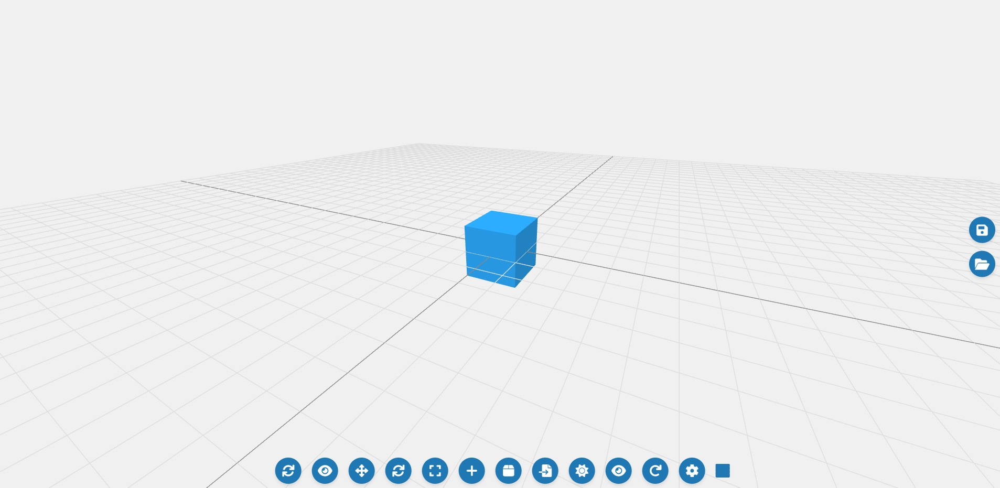
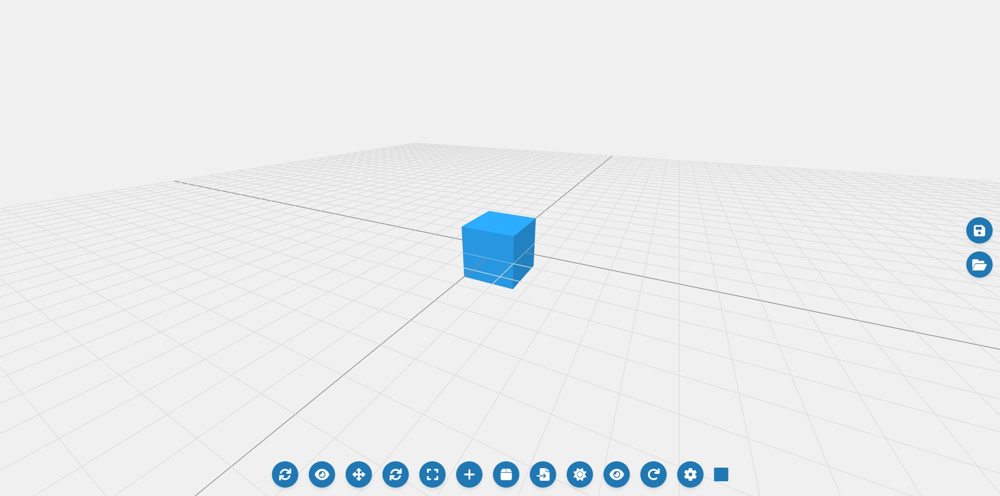
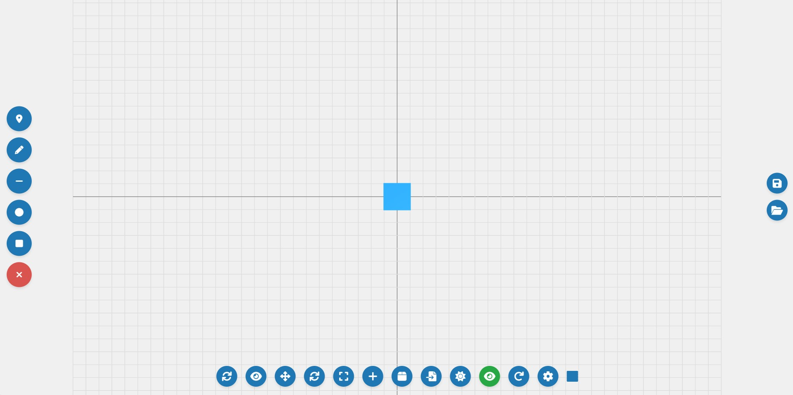
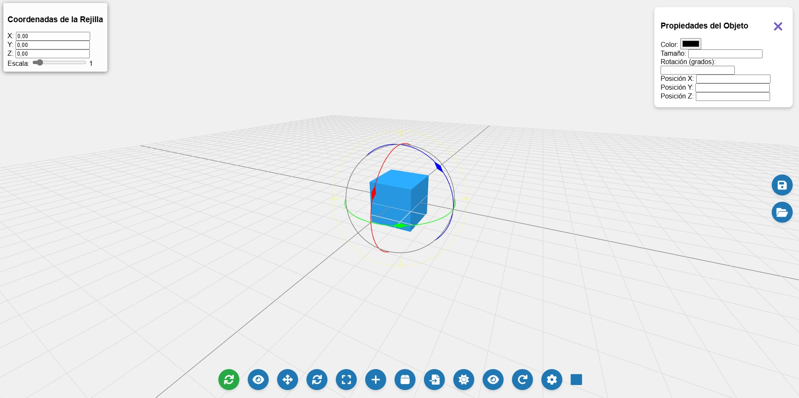

# Unicornio 3D CAD 🦄


🎥 Mira el tutorial completo en YouTube: [https://youtu.be/s7QyHdu7SZs](https://youtu.be/s7QyHdu7SZs)


## Acceso Rápido a la Aplicación
[Unicornio 3D CAD - Demo en vivo](https://xococode.github.io/Unicornio3d/)

Unicornio 3D CAD es una aplicación web que permite crear, editar y manipular modelos 3D de forma intuitiva y visual. Utiliza la librería Three.js para renderizado en 3D y ofrece herramientas avanzadas de modelado y dibujo en 2D y 3D.

## Características principales ✨
- **Modelado 3D interactivo**: Añade, escala, rota y mueve objetos 3D en tiempo real.
- **Vista 2D y herramientas de dibujo**: Traza líneas, círculos, cuadrados y puntos de referencia.
- **Transformación de rejilla**: Rotación, escalado y movimiento de la rejilla con reflejo en objetos 3D.
- **Importación de modelos**: Carga archivos `.gltf`, `.glb` y `.obj` directamente a la escena.
- **Gestión de materiales y colores**: Cambia el color y material de los objetos con herramientas visuales.
- **Guardado y carga de escenas**: Guarda tu escena actual como archivo JSON y vuelve a cargarla para continuar el trabajo.
- **Animación y movimiento**: Suelta objetos desde el cielo y observa su caída con detección de colisión.
- **Atajos de teclado**: Deshacer (Ctrl+Z), Rehacer (Ctrl+Y), Duplicar objetos (Ctrl+D), Eliminar (Delete).

## Capturas de pantalla 📸

### Modo 3D


### Modo 2D (Vista Frontal)


### Panel de propiedades


## Instalación y uso 🚀
### 1. Clona este repositorio:
```bash
git clone https://github.com/tuusuario/unicornio3d-cad.git
cd unicornio3d-cad
```

### 2. Abre el archivo `index.html` en tu navegador:
```bash
open index.html
```

### 3. Requisitos adicionales:
- **Three.js** (incluido por CDN)
- **OrbitControls y TransformControls** (integrados en el proyecto)
- **FontAwesome** para iconos visuales.

## Instrucciones de uso 🛠️
- **Añadir objetos 3D**: Haz clic en el botón de "Agregar Caja" para añadir una nueva caja a la escena.
- **Mover/Reescalar/Rotar objetos**: Selecciona un objeto y usa los botones de control o las teclas rápidas.
- **Vista 2D (Top/Frontal)**: Cambia a la vista superior o frontal para trabajar en 2D.
- **Dibujo libre y líneas**: Usa la herramienta "Trazado Libre" para dibujar a mano alzada o añadir líneas/puntos.
- **Importar modelos 3D**: Haz clic en el botón de importación y selecciona un archivo `.gltf`, `.glb` o `.obj`.

## Atajos de teclado ⌨️
- **Ctrl + Z**: Deshacer.
- **Ctrl + Y / Ctrl + Shift + Z**: Rehacer.
- **Ctrl + D**: Duplicar objeto.
- **Delete**: Eliminar objeto seleccionado.
- **P**: Mostrar/Ocultar el panel de propiedades.

## Futuras mejoras 📈
- Añadir exportación a formatos STL/OBJ.
- Implementación de animaciones más complejas.
- Simulación de físicas en tiempo real.
- Mejoras en la interfaz de usuario.

---

## Contribuciones 🤝
Las contribuciones son bienvenidas. Si deseas agregar nuevas funcionalidades o solucionar errores, por favor crea un fork del repositorio y envía un pull request.

---

_Desarrollado con ❤️ y Three.js._


## Descargo de Responsabilidad

**Importante:** El uso de este código es bajo total responsabilidad del usuario. ** Xocostudio** no se hace responsable por ningún tipo de mal uso, daño directo o indirecto, pérdida de datos, o cualquier otro perjuicio que pueda derivarse del uso de este software.

### Sin Garantías

El software se proporciona "tal cual", sin garantías de ningún tipo, ya sean expresas o implícitas. Esto incluye, pero no se limita a, las garantías de comerciabilidad, adecuación para un propósito particular y no infracción.

### Exención de Responsabilidad

Los autores no son responsables por cualquier reclamación, daño u otra responsabilidad que surja del uso del software, ya sea en una acción de contrato, agravio o de otra manera, que surja de, fuera de o en conexión con el software o el uso u otros tratos en el software.

### Uso del Código

Al descargar y utilizar este código, aceptas hacerlo bajo tu propio riesgo. Es tu responsabilidad asegurarte de que el software es adecuado para tus necesidades y de tomar todas las precauciones necesarias para evitar posibles daños o pérdidas.


Si tienes alguna pregunta o necesitas más información, por favor contacta a Xocostudio.

---

*¡Gracias por utilizar nuestro software! Asegúrate de leer y entender este descargo de responsabilidad antes de proceder.*


